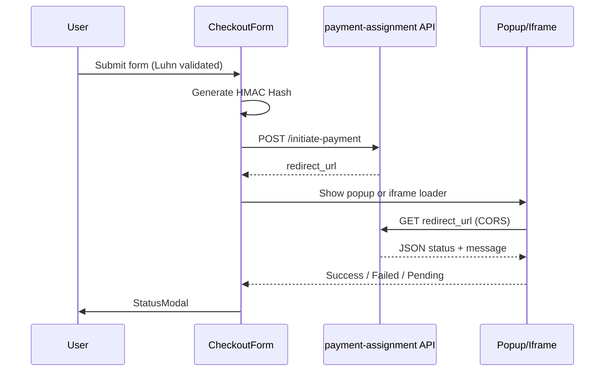

# QuickPay

A secure payment checkout and transaction dashboard built with React, TypeScript, and Vite for the AxiPay payment assignment.

**API base URL:** `https://payment-assignment.onrender.com`

## Live Demo

Deploy with Vercel, Netlify, or GitHub Pages:

```bash
pnpm build
# Deploy the dist/ folder
```

Add your live URL here after deployment.

## Features

### Checkout (`/`)

- Collects card holder, email, card details, amount, currency, billing address, and phone
- **Luhn validation** on card numbers before submission
- **Card brand icons** (Visa, Mastercard, Amex, Discover, RuPay)
- **Masked card display** (first 6 + last 4 visible when blurred)
- **Masked CVV** via password input; never logged to console
- **HMAC-SHA256** `Hash` header per API spec (secret: `AXI2026`)
- Payment redirect via **popup window** or **iframe** (user-selectable)
- Redirect completion via **CORS GET** on `redirect_url` (JSON response)
- Status modal for **Success**, **Failed**, and **Pending**

### Dashboard (`/dashboard`)

- **Summary cards:** total transactions, success volume, success count, failed + pending count
- **Charts:** status breakdown (doughnut), volume over time (line), currency distribution (doughnut)
- **Paginated transaction table** with masked card numbers and `***` for CVC
  - Default page size: **10** (options: 5, 10, 20, 50)
  - `GET /transactions?page={page}&limit={limit}`
- Charts and summary use a dedicated fetch (`page=1`, `limit=500`) for aggregate metrics

### 404 (`/*`)

- Catch-all route with a link back to checkout

## Routes

| Path | Page |
|------|------|
| `/` | Checkout |
| `/dashboard` | Transaction dashboard |
| `*` | 404 Not Found |

Pages are **lazy-loaded** with a shared loading fallback (`PageFallback`).

## Project Structure

```
src/
├── App.tsx                      # BrowserRouter entry
├── routes/
│   └── AppRoutes.tsx            # Lazy routes + Suspense
├── pages/
│   ├── CheckoutPage.tsx
│   ├── DashboardPage.tsx
│   └── NotFoundPage.tsx
├── layout/
│   └── AppLayout.tsx              # Header nav + outlet
├── components/
│   ├── CheckoutForm.tsx           # Payment form + redirect flow
│   ├── PaymentRedirect.tsx        # Popup / iframe handler
│   ├── StatusModal.tsx
│   ├── PageFallback.tsx           # Route loading UI
│   ├── MaskedCardInput.tsx
│   ├── MaskedCvvInput.tsx
│   ├── PhoneInput.tsx
│   ├── CardBrandIcon.tsx
│   ├── DashboardSummary.tsx
│   ├── TransactionCharts.tsx
│   ├── TransactionTable.tsx
│   └── Pagination.tsx
├── hooks/
│   ├── useInitiatePayment.ts
│   ├── useCompletePaymentRedirect.ts
│   └── useTransactions.ts
├── services/
│   ├── client.ts                  # API_BASE_URL, error helpers
│   ├── initiatePayment.ts         # POST /initiate-payment
│   ├── completePaymentRedirect.ts # GET redirect_url
│   └── fetchTransactions.ts       # GET /transactions
├── utils/
│   ├── crypto.ts                  # HMAC-SHA256 hash
│   ├── cardNumberValidation.ts    # Luhn check
│   ├── maskCardNumber.ts          # Card masking
│   ├── validation.ts              # Zod schema
│   ├── transactions.ts            # API → domain mapping
│   ├── dashboard.ts               # Metrics + chart helpers
│   ├── paymentProcessingTemplate.ts
│   ├── paymentStatusTemplate.ts
│   └── paymentRedirectWindow.ts
├── constants/
│   └── dashboard.ts               # Pagination defaults
└── types/
    └── index.ts
```

## API Integration

| Method | Endpoint | Purpose |
|--------|----------|---------|
| `POST` | `/initiate-payment` | Start payment; returns `redirect_url` |
| `GET` | `{redirect_url}` | Complete payment; returns JSON `{ status, message }` |
| `GET` | `/transactions?page=&limit=` | List transactions |

### Initiate payment

- Request body uses camelCase (`orderId`, `cardNumber`, `cardCVC`, etc.)
- Response uses `redirect_url` for the redirect step

### Transactions

- Table: `page` + `limit` from pagination controls
- Charts/summary: `page=1`, `limit=500` (`TRANSACTIONS_CHART_LIMIT`)

## Payment Flow



### Hash Generation

1. Extract first 6 and last 4 digits of card number
2. Concatenate → reverse the 10-digit string
3. Reverse email → build `reverse(email) + "AXIPAYS" + reverse(digits)`
4. Uppercase → HMAC-SHA256 with key `AXI2026` → uppercase hex `Hash` header

## Assumptions & Decisions

- **Redirect status:** Fetched by calling `redirect_url` from the parent window (CORS-enabled JSON), not `postMessage`
- **Request deduplication:** Concurrent redirect GETs are cached briefly (React Strict Mode)
- **Popup blocked:** Verification still runs on the main page; user sees an inline warning
- **Card masking:** Raw digits in form state only; UI masks on blur
- **Failed count metric:** Includes both **Failed** and **Pending** per assignment spec
- **Volume over time:** Sums successful amounts grouped by `created_at` date
- **No backend proxy:** Hash is computed client-side as required by the assignment
- **Charts vs table:** Separate API calls so summary/charts can use more rows than the current table page

## Scripts

```bash
pnpm install
pnpm dev       # http://localhost:5173
pnpm build     # production build → dist/
pnpm preview   # preview production build
pnpm lint      # ESLint
```

## Tech Stack

- React 19 + TypeScript
- Vite 8
- Tailwind CSS 4
- React Hook Form + Zod
- Axios
- Chart.js + react-chartjs-2
- React Router 7
